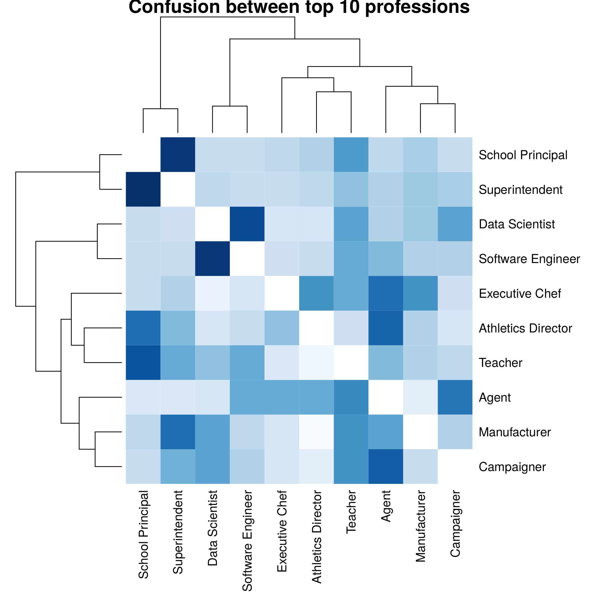

This repository contains code and data accompanying the publication "Social Media-Predicted Personality Traits Can Help Match People to their Ideal Jobs" [Kern et al, PNAS'20].

Reference:
===
```
[Kern et al, PNAS'20] Kern, M. L., McCarthy, P. X., Chakrabarty, D., & Rizoiu, M.-A. (2020). Social Media-Predicted
Personality Traits Can Help Match People to their Ideal Jobs. Proceedings of the National Academy of Sciences.
```

Repository content:
===

This repository contains the following code scripts:  

* `scripts/vocation-map.R` -- R script to build the Vocation Map starting from occupation psychological profiles (stored in the file `data/profession-profiles.csv`);
* `scripts/predict-profession-python.ipynb` -- Python Jupyter notebook to build predictors for forecasting user occupation.
* `scripts/prediction-step1-run-prediction.sh` -- Bash script to transform the Jupyter notebook to a `py` file and run it without a graphical interface;
* `scripts/prediction-step2-read-prediction-models-from-Python.R` -- R script (using the `reticulate` package, which reads Python data sctructures produced by `scripts/predict-profession-python.ipynb` and builds R structures);
* `scripts/prediction-step3-plot-prediction.R` -- R script that plots the prediction performance indicators (Precision, Recall, F1 score and Accuracy);
* `scripts/construct-confusion-matrix.R` -- R script that loads the prediction results (see `data/prediction-results`) and builds the confusion matrix.
* `scripts/utils.R` -- additional functions for reading, writing data and plotting.

The following data and plots is also available:

* `data/profession-profiles.csv` -- contains the psychological profiles for each occupation in the Vocation Map.
* `data/prediction-results/*` -- CSV files containing the model prediction for each classifier, and each fold.
* `plots/vocation-map-static.pdf` -- a static version of the Vocation Map. 
* `plots/vocation-map-interactive.html` -- the interactive version of the Vocation Map. Also available at http://bit.ly/vocation-map-interactive .
* `plots/confusion-heatmap-dendogram.pdf` -- the confusion map for the XGBoost classifier (based on `data/prediction-results/*`)




Additional data file:
===

The following files cannot be publicly shared due to the Twitter's and IBM Watson's Terms of Service.
However, these files could be provided privately upon request, requests are evaluated at a case-by-case basis.

* `data/uniq_data.csv` -- contains the Big5 and the personal values (10 features) for every user in the occupation prediction part of the paper;
* `data/uniq_data_big5.csv` -- contains solely the Big5 traits for the users above (useful for the ablation study);
* `data/uniq_data_values.csv` -- contains solely the personal values for the users above (useful for the ablation study).


License
===

Both data set and code are distributed under the General Public License v3 (GPLv3) license, a copy of which is included in this repository, in the LICENSE file. 
If you require a different license and for other questions, please contact us at Marian-Andrei@rizoiu.eu
