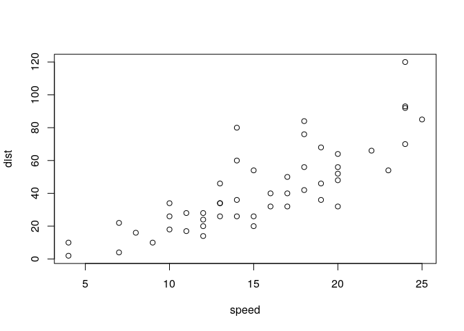

Vocation Map: Linking Social Media-Predicted Personality Traits and
Occupations
================

This repository contains code and data accompanying the publication
“Social Media-Predicted Personality Traits Can Help Match People to
their Ideal Jobs” \[Kern et al, PNAS’20\].

\[Kern et al, PNAS’20\] Kern, M. L., McCarthy, P. X., Chakrabarty, D., &
Rizoiu, M.-A. (2020). Social Media-Predicted Personality Traits Can Help
Match People to their Ideal Jobs. Proceedings of the National Academy of
Sciences.

This is an [R Markdown](http://rmarkdown.rstudio.com) Notebook. When you
execute code within the notebook, the results appear beneath the code.

Try executing this chunk by clicking the *Run* button within the chunk
or by placing your cursor inside it and pressing *Ctrl+Shift+Enter*.

``` r
plot(cars)
```

<!-- -->

Add a new chunk by clicking the *Insert Chunk* button on the toolbar or
by pressing *Ctrl+Alt+I*.

When you save the notebook, an HTML file containing the code and output
will be saved alongside it (click the *Preview* button or press
*Ctrl+Shift+K* to preview the HTML file).

The preview shows you a rendered HTML copy of the contents of the
editor. Consequently, unlike *Knit*, *Preview* does not run any R code
chunks. Instead, the output of the chunk when it was last run in the
editor is displayed.

# License

Both dataset and code are distributed under the Creative Commons
Attribution-NonCommercial 4.0 International (CC BY-NC 4.0) license, a
copy of which can be obtained following this link. If you require a
different license, please contact us at <Marian-Andrei@rizoiu.eu>
